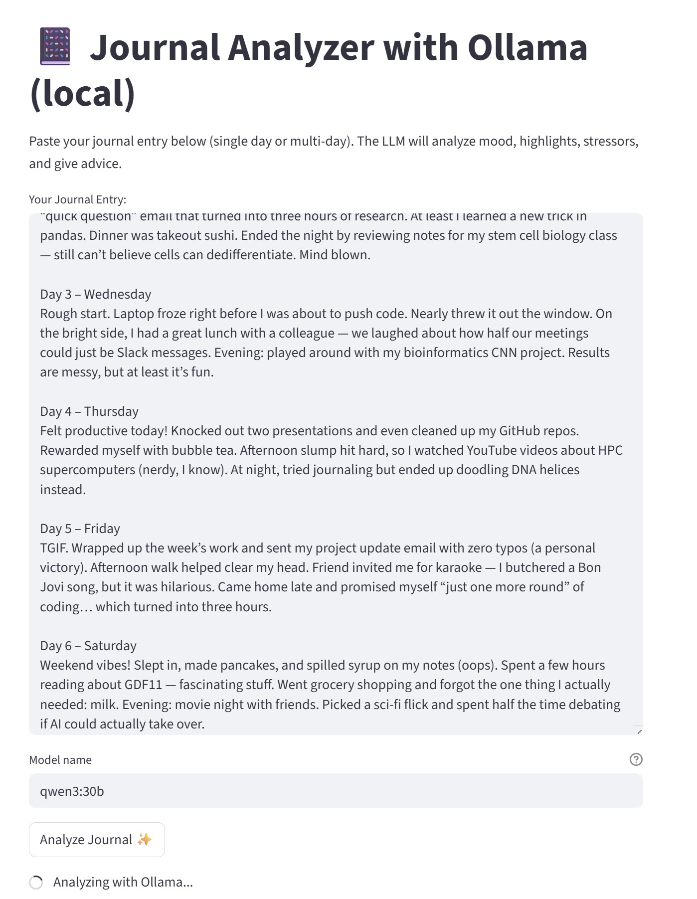
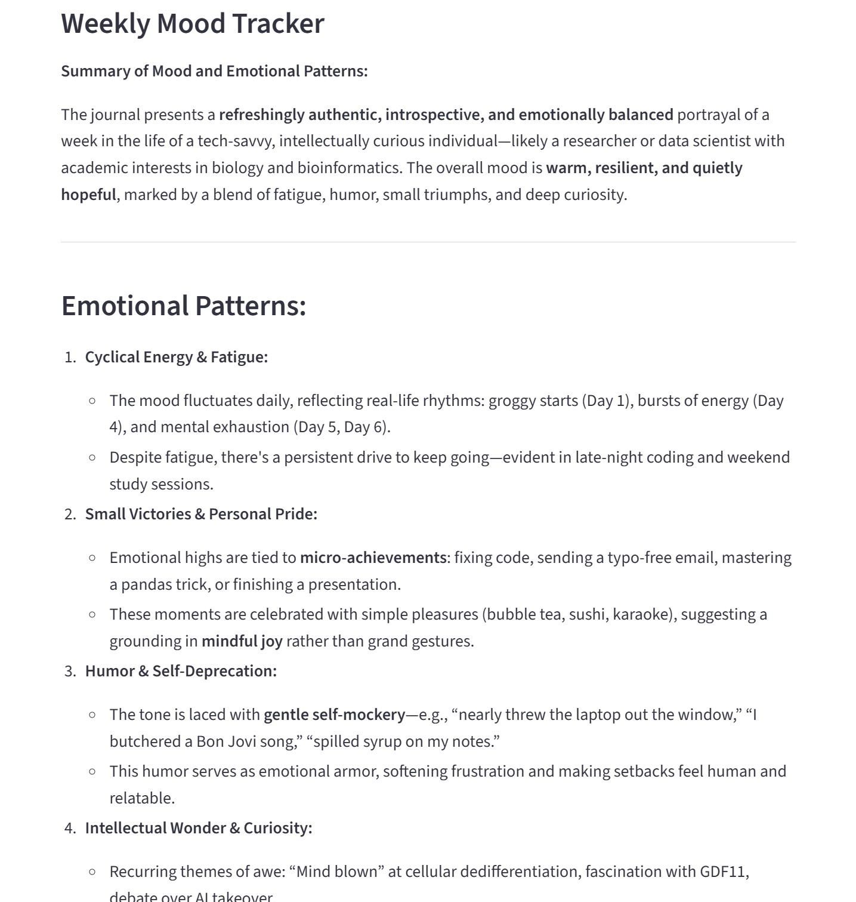
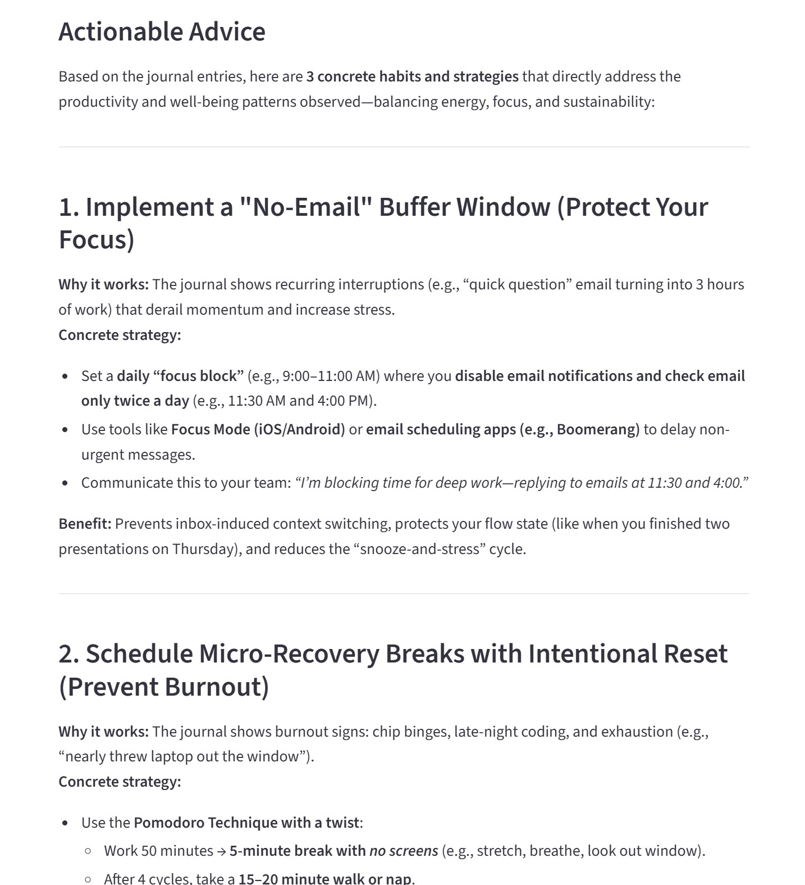
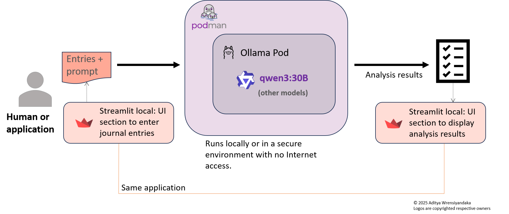

# ✍️ Journal Analyzer with LLM
### Author: Aditya Wresniyandaka, Fall 2025

## 📌 Objective
Some people like to write journals because it helps them reflect, process their thoughts, and capture daily experiences. But often, these journals sit untouched, never analyzed, and the insights they contain are left unused. This project bridges that gap by turning your raw journal entries into actionable insights using a local large language model (LLM). Running the model locally ensures that your private thoughts never leave your computer, giving you full control over sensitive personal information; i.e., no cloud uploads, no third-party access, and complete privacy for your journal entries.

## 🖼 What the application does
<ul>
<li>Accepts one or more days of journal entries as input.
<li>Uses a local Qwen3:30B model, running either in an Ollama Podman container inside WSL on Windows or via native Podman on Linux, to analyze the journal entries.
<li>Generates structured insights including:
<uL>
<li>Overall mood and emotional patterns
<li>Work/study vs. leisure balance
<li>Highlights and stressors
<li>Actionable “You should…” advice for productivity and well-being
</ul>
</ul>
The goal is simple: <b>make your journaling actionable.</b>

## 🖼 Sample Journal Entry & Analysis

The sample journal entry below was created in collaboration with ChatGPT to illustrate the kind of input the app can handle. Following that, example outputs and screenshots show the insights generated by the Streamlit app.

### Sample journal entry
```
Day 1:
Woke up feeling energetic. Had a great morning run and completed the report for work.  

Day 2:
Felt a bit stressed in the afternoon. Managed to finish a coding task but skipped lunch.  

Day 3:
Relaxed morning, read some articles on AI. Worked on project planning in the evening.  

Day 4:
Busy day at work. Met deadlines but felt mentally drained. Went for a short walk.  

Day 5:
Had a productive coding session. Enjoyed some time cooking dinner.  

Day 6:
Attended a webinar on machine learning. Felt inspired to try new experiments.  

Day 7:
Feeling a bit tired after the week. Managed to finish coding the Python project. Read a chapter of a new book. Relaxed with some music before bed.
```

### Sample screenshots of Streamlit UI and analysis output

#### Input to the Streamlit UI (synthetic journal entries generated by ChatGPT as an example)
<b><p>


#### Overall mood and emotional patterns
<b><p>


#### Actionable advice


## 🏗 Application architecture

The main elements of the architecture are:
<ul>
<li><b>Streamlit App</b>: a single Python file; user-friendly web interface for inputting journals and displaying analysis.
<li><b>Ollama Pod</b>: it hosts the model locally in a container for easy model swapping and isolated execution.
<li><b>LLM Model</b>: Qwen3:30B by default, but any Ollama-compatible model can be swapped in for experimentation or performance tuning.
</ul>
<br>
<p>


## ⚙️ Getting started
### Setup prerequisites
<ul>
<li>Windows users: Install WSL2 and a Linux distribution of your choice.
<li>Linux users: Install Podman. Ensure it’s working by running:

```
podman info
```
</ul>
These are the basic steps to get started with the Journal Analyzer using a local LLM:
<ol>
<li>Run Ollama Pod in WSL (Windows) or native Podman (Linux), for example:

```
podman run -d \
  --name ollama \
  --platform linux/amd64 \
  -p 0.0.0.0:11434:11434 \
  -v ollama:/root/.ollama \
  -e OLLAMA_USE_GPU=true \
  ollama/ollama:latest
```
<li>Pull the model inside the pod:

```
podman exec -it ollama ollama pull qwen3:30b
```
<li>Create a Python environment (recommended) and install libraries/dependencies

```
pip install streamlit requests
```
<li>Run the Streamlit app inside the Python environment

```
streamlit run journal_analyzer.py
```
<li>Open the app in your browser and paste your journal entries to run the analysis!
</ol>

## 💡 Closing thoughts
This project shows how journaling and AI can complement each other. Writing alone is reflection; analyzing is insight; and applying insights is growth. By combining a local LLM with a simple Streamlit interface, you can transform passive journaling into an actionable habit, all while keeping your data private and fully under your control.
The setup is modular: swap models, add more analysis prompts, or integrate other data sources. The architecture is simple but flexible, designed for experimentation and personal productivity.

## 🔮 Future Enhancements

Currently, the analysis prompt is embedded directly in the application. Moving it into a separate file or repository would allow for version control, easier experimentation, and sharing improvements without modifying the main app.

Future improvements could include support for multiple models, allowing fast, lightweight models for quick journaling and larger models for deep analysis. Streaming responses would provide near-instant feedback, while voice input and text-to-speech output could turn the app into a full personal AI assistant. Additional features like visualizing mood trends over time or integrating external data sources could further help users gain actionable insights from their journals.

## 📝 Sample code disclaimer

The sample code provided in this repository is intended for educational and experimental use. It is offered *as-is*, and may require adjustment based on your specific hardware (e.g., GPU memory) and software configuration (e.g., Python version, library compatibility).

## 📖 Citation & acknowledgments

If you find the code useful and plan to use it in your work, please cite or link to the GitHub repository. You are welcome to adapt and extend it; just include appropriate credit.

📚 BibTeX
```
@misc{cyphermind2025,
  author       = {Aditya Wresniyandaka},
  title        = {Journal Analyzer with Local LLM},
  year         = {2025},
  howpublished = {\url{https://github.com/adityatw/lorajournal}},
  note         = {GitHub repository}
}
```

### Text generation
Some portions of this document were co-authored with [OpenAI ChatGPT](https://chatgpt.com/) to improve clarity, readability, and efficiency. All technical content, code, and design decisions remain authored by the project creator.

Design and code © 2025 <a href="https://www.linkedin.com/in/aditya-wresniyandaka-3b2670" target = "_blank">Aditya Wresniyandaka</a> | Built and tested with Python 3.12/3.13